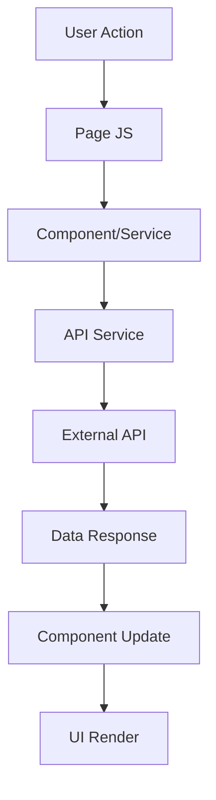

# ZainFlix Project Structure

## Overview

ZainFlix is organized with a modern component-based architecture for maximum maintainability and scalability.

## Directory Structure

```
ZainFlix/
├── src/                          # Source code
│   ├── pages/                    # HTML pages (entry points)
│   │   ├── index.html           # Landing/marketing page
│   │   ├── login.html           # User authentication
│   │   ├── register.html        # New user registration
│   │   ├── profile.html         # Profile selection
│   │   ├── home.html           # Main content browser
│   │   ├── mylist.html         # User's saved content
│   │   └── video-player.html   # Media player
│   ├── assets/                   # Static assets
│   │   ├── styles/              # CSS stylesheets
│   │   │   ├── base/           # Foundational styles
│   │   │   │   ├── variables.css    # CSS variables
│   │   │   │   ├── reset.css        # CSS reset
│   │   │   │   └── typography.css  # Typography base
│   │   │   ├── components/     # Reusable component styles
│   │   │   │   ├── buttons.css      # Button variations
│   │   │   │   ├── cards.css        # Movie/tv cards
│   │   │   │   ├── modals.css       # Modal dialogs
│   │   │   │   ├── navigation.css   # Navigation components
│   │   │   │   └── notifications.css # Notification system
│   │   │   ├── layout/         # Layout-specific styles
│   │   │   │   ├── header.css       # Site header
│   │   │   │   ├── footer.css       # Site footer
│   │   │   │   └── grid.css         # Grid system
│   │   │   └── pages/          # Page-specific styles
│   │   │       ├── auth.css         # Login/register
│   │   │       ├── home.css        # Home dashboard
│   │   │       ├── profile.css      # Profile selection
│   │   │       ├── mylist.css      # My list page
│   │   │       └── video-player.css # Video player
│   │   ├── scripts/             # JavaScript modules
│   │   │   ├── core/           # Core functionality
│   │   │   │   ├── main.js         # Application entry
│   │   │   │   ├── router.js       # Client-side routing
│   │   │   │   └── utils.js        # Utility functions
│   │   │   ├── components/     # Reusable JavaScript components
│   │   │   │   ├── Modal.js        # Modal system
│   │   │   │   ├── NotificationManager.js # Notifications
│   │   │   │   ├── ProfileManager.js # Profile management
│   │   │   │   └── VideoPlayer.js  # Media player
│   │   │   ├── services/       # Data and API services
│   │   │   │   ├── api.js          # API configuration
│   │   │   │   ├── auth.service.js # Authentication
│   │   │   │   ├── movie.service.js # Movie data
│   │   │   │   └── mylist.service.js # User's list
│   │   │   └── pages/          # Page-specific JavaScript
│   │   │       ├── home.js         # Home page logic
│   │   │       ├── profile.js      # Profile logic
│   │   │       ├── mylist.js       # My list logic
│   │   │       └── video-player.js # Player logic
│   │   └── images/             # Static images
│   │       ├── icons/          # Icon files
│   │       └── backgrounds/    # Background images
├── public/                       # Public static files
│   ├── favicon.ico            # Site favicon
│   └── manifest.json          # PWA manifest
├── docs/                        # Documentation
│   ├── DEVELOPMENT.md         # Development guide
│   ├── API.md                 # API documentation
│   └── DEPLOYMENT.md          # Deployment guide
├── tests/                       # Test files
│   ├── unit/                  # Unit tests
│   └── integration/           # Integration tests
├── .gitignore                   # Git ignore rules
├── package.json                 # Project configuration
├── README.md                    # Project overview
└── server.js                    # Development server (optional)
```

## Key Architectural Decisions

### 1. **Component-Based Architecture**
- Reusable components in `src/assets/scripts/components/`
- Shared styles in `src/assets/styles/components/`
- Consistent patterns across all pages

### 2. **Separation of Concerns**
- **Presentation**: HTML templates in `src/pages/`
- **Styling**: CSS organized by function (base, components, pages)
- **Logic**: JavaScript modules organized by responsibility
- **Data**: API services separated from UI logic

### 3. **Modular JavaScript**
- ES6 modules for better code organization
- Clear import/export structure
- Services for API calls and data management
- Components for UI interactions

### 4. **Responsive First Design**
- Mobile-first CSS approach
- Flexible grid system
- Component-level responsive breakpoints

## Data Flow



## Naming Conventions

### Files
- **kebab-case** for files: `video-player.js`, `profile-management.css`
- **PascalCase** for classes: `VideoPlayer`, `ProfileManager`
- **camelCase** for functions/variables: `getUserData()`, `movieList`

### CSS Classes
- **BEM methodology**: `.block__element--modifier`
- Component prefixes: `.modal__`, `.notification--`
- Utility classes: `.text-center`, `.flex-column`

### JavaScript
- ES6+ features preferred
- Async/await for API calls
- Event delegation for dynamic content
- Error boundaries and try-catch blocks

## Import/Export Patterns

```javascript
// Services import configuration
import { API_CONFIG } from '../services/api.js';

// Pages import components and services
import { Modal } from '../components/Modal.js';
import { MyListService } from '../services/mylist.service.js';

// Export classes and functions
export class MovieModal extends Modal { }
export const showNotification = (message) => { };
```

## State Management

- **Local Storage**: User session, profile data, preferences
- **Component State**: UI state managed within components
- **Global State**: Shared through service classes
- **URL State**: Page parameters and navigation

## API Integration

- Single configuration file: `src/assets/scripts/services/api.js`
- Service classes for different data types
- Error handling and retry logic
- Request/response interceptors

## Testing Strategy

- **Unit Tests**: Component and service functions
- **Integration Tests**: User flows and API interactions
- **E2E Tests**: Critical user journeys
- **Visual Regression**: UI consistency testing

## Performance Considerations

- **Code Splitting**: Load components on demand
- **Image Optimization**: Responsive images and lazy loading
- **Caching**: Service workers for offline functionality
- **Bundle Analysis**: Monitor bundle size and dependencies

## Security Measures

- **Input Validation**: Sanitize user inputs
- **XSS Prevention**: Proper content escaping
- **API Security**: Token-based authentication
- **CORS Configuration**: Proper cross-origin setup

This structure is designed to scale with the application while maintaining code quality and developer productivity.